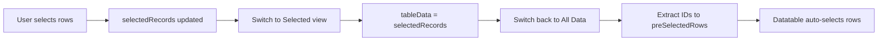

## Overview

The Action List Opportunity component provides robust row selection capabilities with persistent selection state when switching between views. Users can select individual rows and toggle between viewing all records or only selected records.

## Selection State Management

The component tracks selection using several state variables:

```javascript operationDatatable.js
preSelectedRows = [];      // Array of IDs for pre-selecting rows
selectedRecords = [];      // Array of currently selected record objects
hiddenCheckBox = false;    // Controls checkbox visibility
isSelected = false;        // Tracks which view is active
```

## Row Selection Handler

The `handleRowSelectionTable` method captures selection changes from the lightning-datatable:

```javascript operationDatatable.js:45-51
handleRowSelectionTable(e) {
   const selectedRows = JSON.parse(JSON.stringify(e.detail.selectedRows));
   if (!this.hiddenCheckBox) {
      this.selectedRecords = selectedRows;
   }
}
```

<Note>
**Deep cloning**: The method uses `JSON.parse(JSON.stringify())` to create a deep copy of the selected rows, preventing reference issues.
</Note>

**Key behaviors:**
- Only updates selection when checkboxes are visible (`!hiddenCheckBox`)
- Stores complete record objects, not just IDs
- Triggered on every selection/deselection event

## View Switching

### Switching to Selected View

The `handleClickSelected` method switches to show only selected records:

```javascript operationDatatable.js:53-60
handleClickSelected() {
   if (this.selectedRecords.length === 0) {
      this.existingRecord = false;
   }
   this.isSelected = true;
   this.hiddenCheckBox = true;
   this.tableData = this.selectedRecords;
}
```

**What happens:**
1. Checks if any records are selected
2. Sets `existingRecord = false` if selection is empty (shows empty state)
3. Sets `isSelected = true` to activate selected view mode
4. Hides checkboxes (`hiddenCheckBox = true`)
5. Updates table to show only selected records

<Info>
Checkboxes are hidden in the selected view since all displayed records are already selected.
</Info>

### Switching to All Data View

The `handleClickAllData` method returns to the full dataset view:

```javascript operationDatatable.js:62-74
handleClickAllData() {
   this.existingRecord = true;
   this.isSelected = false;
   let preSelectedRowsId = [];
   //this.showSpinner = true;
   this.hiddenCheckBox = false;
   this.selectedRecords.forEach(items => {
      preSelectedRowsId.push(items.Id);
   });
   this.tableData = this.data;
   this.preSelectedRows = preSelectedRowsId;
   //this.showSpinner = false;
}
```

**What happens:**
1. Sets `existingRecord = true` to ensure table is shown
2. Sets `isSelected = false` to deactivate selected view mode
3. Creates array of selected record IDs
4. Shows checkboxes again (`hiddenCheckBox = false`)
5. Restores full dataset to table
6. **Preserves selection** by setting `preSelectedRows` with IDs

<Tip>
The `preSelectedRows` property is bound to the datatable's `selected-rows` attribute, automatically restoring the selection state when switching views.
</Tip>

## Persistent Selection Pattern

The component maintains selection persistence through this flow:



## Selection Counter

The component displays a live count of selected records:

```javascript operationDatatable.js:139-141
get getSelectedRecords() {
   return `Selected (${this.selectedRecords.length})`;
}
```

This getter is bound to a button label to show users how many records they've selected.

## Empty State Handling

```javascript
if (this.selectedRecords.length === 0) {
   this.existingRecord = false;
}
```

When no records are selected and the user switches to the selected view, `existingRecord = false` triggers an empty state message in the UI.

## Usage Flow

<Steps>
  <Step title="Select Records">
    Check the boxes next to the records you want to select in the All Data view
  </Step>
  <Step title="View Selected">
    Click the "Selected (n)" button to see only your selected records
  </Step>
  <Step title="Review Selection">
    Review your selected records without distractions (checkboxes are hidden)
  </Step>
  <Step title="Return to All Data">
    Click "Records (n)" to return to the full dataset with your selection preserved
  </Step>
</Steps>

## Best Practices

<AccordionGroup>
  <Accordion title="When to use Selected view">
    Use the selected view when you need to focus on a subset of records for review, export, or bulk actions.
  </Accordion>
  <Accordion title="Selection persistence">
    Selection persists across view switches, so you can safely toggle between views without losing your selection.
  </Accordion>
  <Accordion title="Filtering selected records">
    When in selected view, filters apply only to the selected subset using client-side filtering.
  </Accordion>
</AccordionGroup>

<Warning>
The `hiddenCheckBox` variable controls whether the datatable shows checkboxes. When `true`, users cannot modify the selection.
</Warning>
