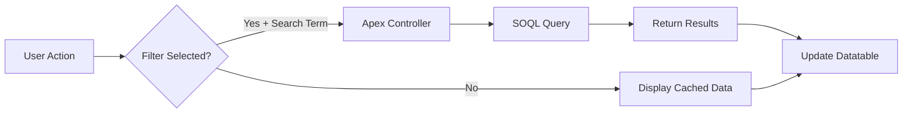

## Overview

This guide will walk you through deploying and using the Action List Opportunity component from scratch. By the end, you'll have a fully functional datatable displaying and filtering your Opportunity records.

<Note>
  **Time to complete**: 5-10 minutes
</Note>

## Prerequisites

Make sure you have:
- Salesforce CLI installed (`sf --version` to verify)
- A Salesforce org with some Opportunity records
- System Administrator access

## Step-by-Step Guide

### 1. Deploy the Component

First, authenticate to your Salesforce org and deploy the component:

<Steps>
  <Step title="Authenticate to Salesforce">
    ```bash
    sf org login web --alias QuickStartOrg
    ```
    This opens your browser for authentication.
  </Step>
  
  <Step title="Deploy Component Files">
    ```bash
    cd /path/to/source
    sf project deploy start --source-path force-app/main/default
    ```
    
    Expected output:
    ```
    Deploy Succeeded
    ├─ ApexClass: OpportunityController
    ├─ LightningComponentBundle: operationDatatable
    ```
  </Step>
</Steps>

<Tip>
  Deployment typically takes 30-60 seconds. If it fails, check that your org API version matches the component's API version (55.0).
</Tip>

### 2. Add to Lightning Page

<Steps>
  <Step title="Open Lightning App Builder">
    Navigate to **Setup** → Type "Lightning" in Quick Find → **Lightning App Builder**
  </Step>
  
  <Step title="Create or Edit Page">
    **Option A**: Create new page
    - Click **New**
    - Choose **App Page**
    - Name it "Opportunity Dashboard"
    - Select a template (recommend "Header and One Region")
    
    **Option B**: Edit existing Home page
    - Select your Home page from the list
    - Click **Edit**
  </Step>
  
  <Step title="Add Component">
    - In the left sidebar, find **"Table Component Custom"**
    - Drag it onto your page (use full-width region)
  </Step>
  
  <Step title="Activate Page">
    - Click **Save**
    - Click **Activate**
    - Choose **App, Record Type, and Profile** assignments
    - Assign to **Sales** app (or desired app)
    - Click **Save**
  </Step>
</Steps>

### 3. View the Component

Navigate to the page where you added the component:

- If you created an App Page: Go to **App Launcher** → **Sales** (or your assigned app)
- If you added to Home: Click **Home** tab

You should see the **Action List Opportunity** card with your opportunity data:

```
┌─────────────────────────────────────────────────────┐
│ Action List Opportunity                       🎯    │
├─────────────────────────────────────────────────────┤
│ [Select Filter ▼] [Search...] [Records] [Selected] │
├─────────────────────────────────────────────────────┤
│ # │ Name           │ StageName  │ CreatedDate │ ... │
│ 1 │ Acme Corp Deal │ Prospecting│ 01/15/2026  │ ... │
│ 2 │ Widget Sale    │ Negotiation│ 02/01/2026  │ ... │
└─────────────────────────────────────────────────────┘
```

<Warning>
  If no data appears, ensure you have Opportunity records in your org and your user has Read access to the Opportunity object.
</Warning>

## Using the Component

### Basic Filtering

Let's filter opportunities by name:

<Steps>
  <Step title="Select Filter Field">
    Click the first dropdown and select **"Name"**
  </Step>
  
  <Step title="Enter Search Term">
    Type part of an opportunity name in the search box (e.g., "Acme")
  </Step>
  
  <Step title="View Filtered Results">
    The table automatically updates to show only matching records
    
    The record count updates: **Records (5)** → **Records (2)**
  </Step>
</Steps>

**Code Behind the Scenes:**

When you search, the component calls the Apex controller:

```javascript
filterRecordsTable() {
   getAllOpportunity({ 
      params: this.valueSearch, 
      filterField: this.valueFilter 
   })
   .then(result => {
      this.tableData = result;
      this.lengthTableData = this.tableData.length;
   })
}
```

The Apex controller builds a dynamic SOQL query:

```apex
public static List<Opportunity> getAllOpportunity(String params, String filterField) {
    String query = 'SELECT Id, Name, StageName, CreatedDate, LeadSource FROM Opportunity';
    if(!String.isBlank(params) && !String.isBlank(filterField)){
        String searchString = '\'%' + params + '%\'';
        query = query + ' WHERE ' + filterField + ' LIKE ' + searchString;
    }
    return Database.query(query);
}
```

### Selecting and Managing Records

Work with specific opportunities using row selection:

<Steps>
  <Step title="Select Records">
    Click checkboxes next to 2-3 opportunities
    
    Notice the **Selected (3)** button updates with the count
  </Step>
  
  <Step title="View Selected Only">
    Click the **"Selected (3)"** button
    
    The table now shows only your selected records
    
    Checkboxes are hidden in this view
  </Step>
  
  <Step title="Return to All Records">
    Click **"Records (X)"** button
    
    All opportunities display again
    
    Your selections remain highlighted
  </Step>
</Steps>

**Selection Logic:**

```javascript
handleRowSelectionTable(e) {
   const selectedRows = JSON.parse(JSON.stringify(e.detail.selectedRows));
   if (!this.hiddenCheckBox) {
      this.selectedRecords = selectedRows;
   }
}

handleClickSelected() {
   if (this.selectedRecords.length === 0) {
      this.existingRecord = false; // Shows warning
   }
   this.isSelected = true;
   this.hiddenCheckBox = true;
   this.tableData = this.selectedRecords;
}
```

<Tip>
  Try selecting records, then use the filter to search within your selection. The component supports filtering both all records and selected records.
</Tip>

### Advanced: Filter by Stage

Filter opportunities by their sales stage:

<CodeGroup>
```steps Filter by StageName
1. Click filter dropdown → Select "StageName"
2. Type stage name: "Prospecting" or "Closed Won"
3. View filtered results by stage
```

```example Example Search
Filter: StageName
Search: "Closed"
Result: Shows all opportunities with stages containing "Closed"
        (Closed Won, Closed Lost, etc.)
```
</CodeGroup>

## Understanding the Data Flow

Here's how data moves through the component:



### Wire Service Integration

The component uses `@wire` for automatic data loading:

```javascript
@wire(getAllOpportunity, { params: '', filterField: '' })
getAllOpportunityWire({ data, error }) {
   if (data) {
      this.data = data;
      this.tableData = this.data;
      this.lengthTableData = this.tableData.length;
      this.showSpinner = false;
   } else if (error) {
      console.log(error);
   }
}
```

**Key benefits:**
- Automatic loading on component initialization
- Built-in caching via `@AuraEnabled(cacheable=true)`
- Reactive updates when dependent parameters change

## Common Use Cases

### Use Case 1: Daily Opportunity Review

<Steps>
  <Step title="Morning Dashboard Check">
    Navigate to Home page with the component
    
    View all opportunities at a glance
  </Step>
  
  <Step title="Focus on New Opportunities">
    Sort by CreatedDate (newest first)
    
    Review opportunities created recently
  </Step>
  
  <Step title="Follow Up on Prospects">
    Filter by StageName: "Prospecting"
    
    Select opportunities needing attention
  </Step>
</Steps>

### Use Case 2: Pipeline Review Meeting

<Steps>
  <Step title="Filter by Stage">
    Select StageName filter
    
    Search for "Negotiation"
  </Step>
  
  <Step title="Select Focus Deals">
    Check boxes for deals to discuss
    
    Click "Selected" to isolate them
  </Step>
  
  <Step title="Present Focused View">
    Share screen showing only selected opportunities
    
    Discussion remains focused on key deals
  </Step>
</Steps>

### Use Case 3: Lead Source Analysis

<Steps>
  <Step title="View All Records">
    Start with full dataset visible
  </Step>
  
  <Step title="Filter by Name Pattern">
    Select Name filter
    
    Search for company type (e.g., "Corp" or "Inc")
  </Step>
  
  <Step title="Analyze Lead Sources">
    Review LeadSource column for patterns
    
    Identify most common sources for this segment
  </Step>
</Steps>

## Customization Quick Wins

### Add More Columns

Edit `operationDatatable.js` line 5:

```javascript
const columns = [
   { label: 'Name', fieldName: 'Name' },
   { label: 'StageName', fieldName: 'StageName' },
   { label: 'CreatedDate', fieldName: 'CreatedDate', type: 'date' },
   { label: 'LeadSource', fieldName: 'LeadSource' },
   // Add these:
   { label: 'Amount', fieldName: 'Amount', type: 'currency' },
   { label: 'Close Date', fieldName: 'CloseDate', type: 'date' },
];
```

Update Apex controller (OpportunityController.cls line 5):

```apex
String query = 'SELECT Id, Name, StageName, CreatedDate, LeadSource, Amount, CloseDate FROM Opportunity';
```

Redeploy:
```bash
sf project deploy start --source-path force-app/main/default
```

### Add LeadSource Filter

Edit `operationDatatable.js` line 120:

```javascript
get options() {
   return [
      { label: 'None', value: '' },
      { label: 'Name', value: 'Name' },
      { label: 'StageName', value: 'StageName' },
      { label: 'LeadSource', value: 'LeadSource' }, // New
   ];
}
```

Redeploy and refresh your page.

<Note>
  No Apex changes needed - the controller already supports any filterable field!
</Note>

## Troubleshooting Quick Fixes

<AccordionGroup>
  <Accordion title="Component shows 'No item selected' warning">
    This is expected behavior when you click "Selected" without selecting any records first.
    
    **Fix**: Select one or more records using checkboxes before clicking "Selected"
  </Accordion>
  
  <Accordion title="Search not working">
    Search requires BOTH a filter field AND a search term.
    
    **Steps**:
    1. Select filter (Name or StageName)
    2. Then enter search text
    3. If still not working, check browser console for errors
  </Accordion>
  
  <Accordion title="No data showing">
    **Checklist**:
    - Do opportunities exist? (Check in standard Opportunities tab)
    - Does user have Read access to Opportunity object?
    - Check browser console for errors
    - Verify deployment succeeded: `sf project deploy report`
  </Accordion>
  
  <Accordion title="Component not in App Builder">
    **Fix**:
    1. Verify deployment: `sf project deploy report`
    2. Check `operationDatatable.js-meta.xml` has `<isExposed>true</isExposed>`
    3. Clear browser cache
    4. Try incognito/private browsing window
  </Accordion>
</AccordionGroup>

## Next Steps

Now that you have the component running:

<CardGroup cols={2}>
  <Card title="Customize Fields" icon="table">
    Add more Opportunity fields to display
    
    Edit the columns array and SOQL query
  </Card>
  
  <Card title="Add Filters" icon="filter">
    Enable filtering by additional fields
    
    Update the options getter
  </Card>
  
  <Card title="Extend Functionality" icon="code">
    Add row actions, inline editing, or export
    
    Modify JavaScript and Apex files
  </Card>
  
  <Card title="Style Customization" icon="palette">
    Adjust colors, spacing, and layout
    
    Add CSS file to the LWC bundle
  </Card>
</CardGroup>

## Key Takeaways

<Steps>
  <Step title="Simple Deployment">
    One command deploys both LWC and Apex controller
  </Step>
  
  <Step title="Drag-and-Drop Setup">
    Add to any Lightning page via App Builder
  </Step>
  
  <Step title="Powerful Filtering">
    Server-side search with real-time updates
  </Step>
  
  <Step title="Selection Management">
    Toggle between all records and selected subset
  </Step>
  
  <Step title="Easily Customizable">
    Add fields and filters with minimal code changes
  </Step>
</Steps>

<Tip>
  Bookmark this page for quick reference when training new users or customizing the component!
</Tip>